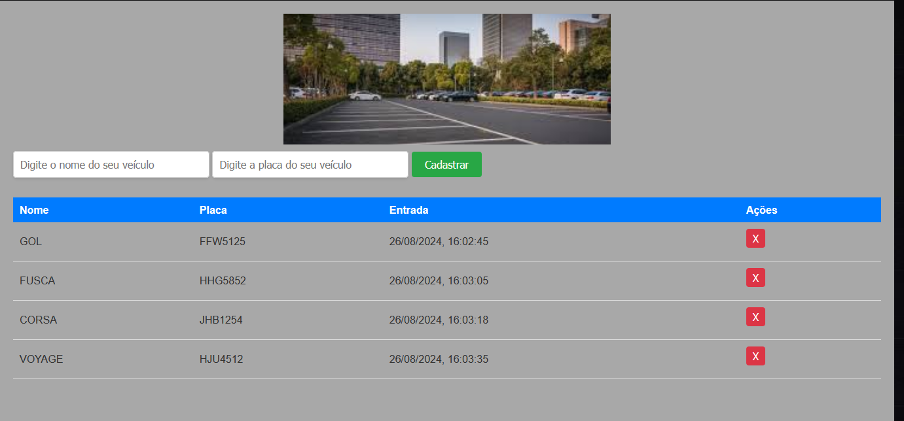

Documentação do Sistema de Estacionamento

Visão Geral

O Sistema de Estacionamento é uma aplicação web desenvolvida para gerenciar o cadastro e controle de veículos em um estacionamento. A aplicação permite o registro de veículos com informações básicas, visualização da lista de veículos cadastrados e remoção de veículos do sistema. As informações dos veículos são armazenadas no localStorage do navegador, garantindo persistência dos dados mesmo após o fechamento do navegador.
Funcionalidades

    Cadastro de Veículos: Permite adicionar um novo veículo informando o nome e a placa. O horário de entrada é registrado automaticamente.
    Listagem de Veículos: Exibe uma tabela com todos os veículos cadastrados, mostrando nome, placa e horário de entrada.
    Remoção de Veículos: Permite remover um veículo da lista e calcula o tempo total que o veículo permaneceu no estacionamento.

Estrutura do Projeto
1. index.html

    Descrição: Arquivo principal que define a estrutura da página.
    Componentes:
        Cabeçalho: Inclui uma imagem de capa.
        Formulário: Campos para inserir o nome e a placa do veículo, e um botão para cadastrar.
        Tabela: Exibe a lista de veículos cadastrados.

2. style.css

    Descrição: Arquivo de estilo que define a aparência da página.
    Componentes:
        Reset Básico: Remove margens e preenchimentos padrão de todos os elementos.
        Estilos Gerais: Define a aparência do corpo da página, cabeçalho, campos de entrada e botões.
        Tabela: Estiliza a tabela onde os veículos são listados, incluindo cabeçalhos e células.

3. script.js

    Descrição: Arquivo JavaScript que gerencia a lógica da aplicação.
    Funcionalidades:
        Leitura de Dados: Recupera dados dos veículos armazenados no localStorage.
        Adição de Veículos: Adiciona novos veículos ao localStorage e atualiza a tabela.
        Remoção de Veículos: Remove veículos do localStorage e calcula o tempo total de permanência.
        Renderização da Tabela: Atualiza a tabela com os veículos cadastrados.

Como Usar

    Abrir a Aplicação: Acesse o arquivo index.html em um navegador web.
    Cadastrar Veículos: Preencha os campos "Nome" e "Placa" e clique no botão "Cadastrar". O veículo será adicionado à lista.
    Visualizar Veículos: Veja a lista de veículos cadastrados na tabela exibida na página.
    Remover Veículos: Clique no botão "X" ao lado do veículo que deseja remover. O tempo total de permanência será exibido em um alerta.

Requisitos

    Navegador web moderno (Google Chrome, Mozilla Firefox, etc.)
    Funcionalidade de localStorage habilitada no navegador
